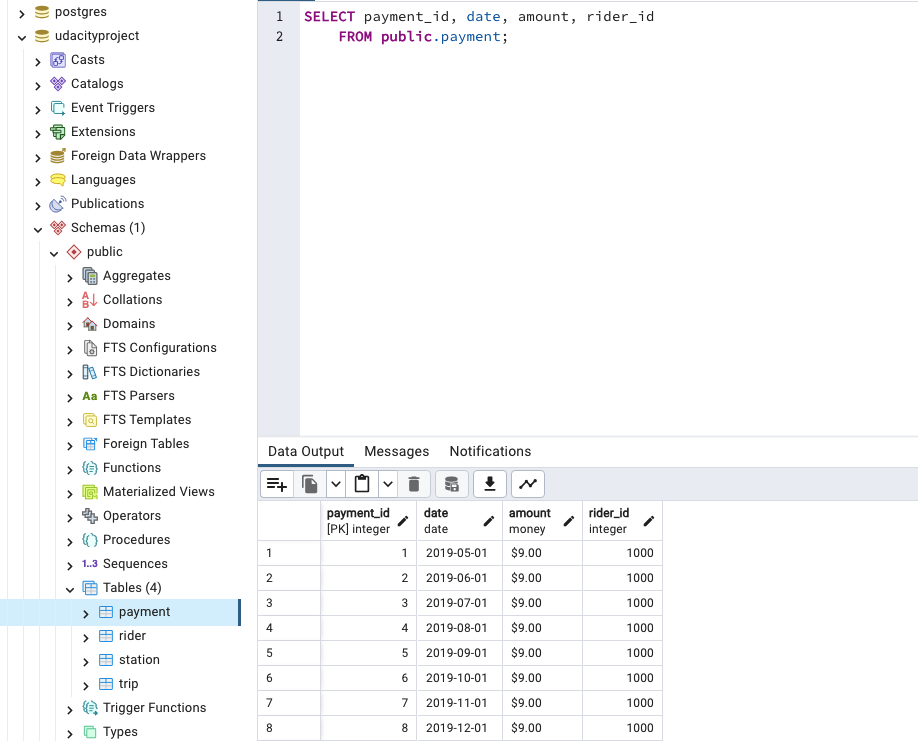
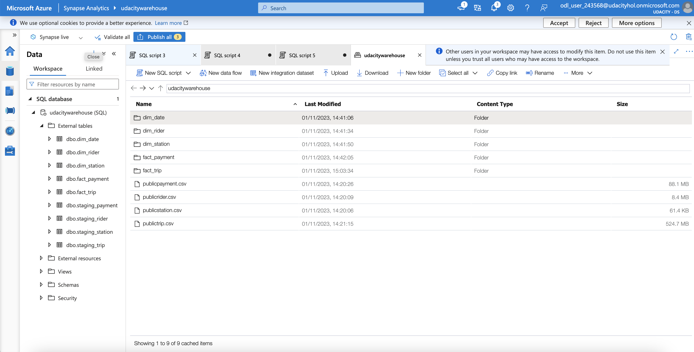

# Building an Azure Data Warehouse for Bike Share Data Analytics

Divvy is a bike sharing program in Chicago, Illinois USA that allows riders to purchase a pass at a kiosk or use a mobile application to unlock a bike at stations around the city and use the bike for a specified amount of time. The bikes can be returned to the same station or to another station. The City of Chicago makes the anonymized bike trip data publicly available for projects like this where we can analyze the data.

Since the data from Divvy are anonymous, we have created fake rider and account profiles along with fake payment data to go along with the data from Divvy. The dataset looks like this:


The goal of this project is to develop a data warehouse solution using Azure Synapse Analytics. We will:

- Design a star schema based on the business outcomes listed below
- Import the data into Synapse
- Transform the data into the star schema
- View the reports from Analytics

## Getting Started

To execute the code the libraries inside requirements.txt should be available in the local computer


### Installation

Running the following command in the Terminal will install the required libraries:

```
pip install -r requirements.txt
```

Also the following is necessary:
- PostgreSQL Server running (see https://postgresapp.com/)
- A client for PostgreSQL (see https://postgresapp.com/documentation/gui-tools.html and https://www.pgadmin.org/)

## Project Steps

### Step 1: Create your Azure resources
- Create an Azure Database for PostgreSQL.
- Create an Azure Synapse workspace.
- Use the built-in serverless SQL pool and database within the Synapse workspace


### Step2: Design a star schema


### Step 3: Create the data in PostgreSQL
To prepare your environment for this project, you first must create the data in PostgreSQL. This will simulate the production environment where the data is being used in the OLTP system. This can be done using the Python script provided ([ProjectDataToPostgres.py](ProjectDataToPostgres.py))

- Place the files of this link (https://video.udacity-data.com/topher/2022/March/622a5fc6_azure-data-warehouse-projectdatafiles/azure-data-warehouse-projectdatafiles.zip) in a folder called "data"
- Open the script file in VS Code and add the host, username, and password information for your PostgreSQL database
- Run the script and verify that all four data files are copied/uploaded into PostgreSQL (this can be done using pgAdmin)



### Step 4: EXTRACT the data from PostgreSQL
In your Azure Synapse workspace, you will use the ingest wizard to create a one-time pipeline that ingests the data from PostgreSQL into Azure Blob Storage. This will result in all four tables being represented as text files in Blob Storage, ready for loading into the data warehouse.


### Step 5: LOAD the data into external tables in the data warehouse
Once in Blob storage, the files will be shown in the data lake node in the Synapse Workspace. From here, you can use the script-generating function to load the data from blob storage into external staging tables in the data warehouse you created using the serverless SQL Pool.


### Step 6: TRANSFORM the data to the star schema using CETAS
Write SQL scripts to transform the data from the staging tables to the final star schema you designed.

The serverless SQL pool won't allow you to create persistent tables in the database, as it has no local storage. So, use CREATE EXTERNAL TABLE AS SELECT (CETAS) instead. CETAS is a parallel operation that creates external table metadata and exports the SELECT query results to a set of files in your storage account.



## License

[License](LICENSE)
